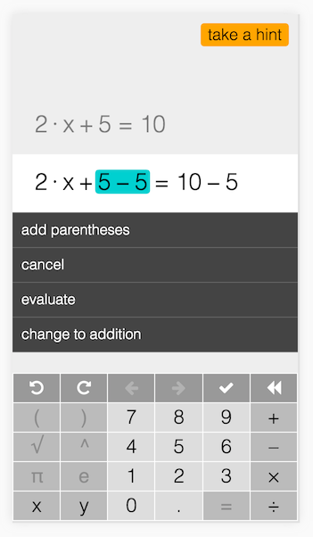

# Algebra Tool

A tool for manipulating algebraic expressions and equations.

## Features

- works with equations and expressions
- basic operations: +, -, *, /
- integers and fractions
- adjust the amount help it gives the student
- undo/redo
- history with descriptions of actions
- hint system (when running the server locally)

## Future

- powers and roots
- absolute value
- trigonometry
- system of equations
- vectors and matrices
- differentiation and integration

## Installation

- `npm install`
- `npm start` (requires node version 4+)
- in another terminal `node api-server.js`
- open [http://localhost:3000](http://localhost:3000) in a browser

## Live Demo

[khan.github.io/algebra-tool](https://khan.github.io/algebra-tool)

- [2x + 5 = 10](https://khan.github.io/algebra-tool/?start=2x+5%3D10&end=x%3D5/2)
- [1/2 + 1/3](https://khan.github.io/algebra-tool/?start=1/2+1/3&end=5/6)
- [12 = 2(x - 1)](https://khan.github.io/algebra-tool/?start=12%3D2(x-1)&end5%3Dx)
- [(4 - x)/3 = 9](https://khan.github.io/algebra-tool/?start=(4-x)/3%3D9&-23%3Dx)

### Supported URL Params

- __start__: URL encoded expression or equation, default: `2x + 5 = 10`
- __end__: URL encoded expression or equation, default: `x = 5/2`
- __eliminateZero__: if an `evaluate` action results in a zero, we will automatically remove it.  TODO: handle division by zero
- __eliminateDivByOne__: if a `cancel` operation results in division by one, we will automatically remove it.
- __autoeval__: compute the result of an `evaluate` action instead of asking the user to input the result.
- __hints__: enables hint system (only works when running locally)

e.g. `localhost:3000/?start=x-1%3D5&end=x%3D6&eliminateZero&eliminateDivByOne&autoeval&hints`

## Contributing

Please report bugs and feature requests to https://github.com/khan/algebra-tool/issues.
